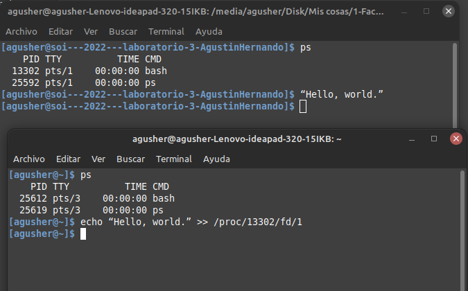
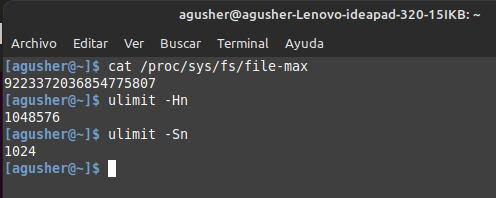

## Actividad 4

**4.1. ¿Cuáles son los tipos de type descriptors que podemos encontrar en /proc//fd?**

Son tres:
  - 0 -> standard input.
  - 1 -> standard output.
  - 3 -> standard error.
    Estos son tres standard streams (flujos estandar) que se establecen cuando se ejecuta un comando de Linux. En informática, un stream es algo que puede transferir datos. En el caso de estos streams, esos datos son texto.

**4.2. Suponiendo que un usuario está ejecutando el proceso pid 1212, ¿Es válida la ejecución del siguiente comando desde una terminal nueva? % echo “Hello, world.” >> /proc/1212/fd/1**

Sí es válido. 
Suponiendo que en la terminal 1 se está ejecutando un proceso cuyo pid es 1212 y en una terminal 2 se ejecuta el comando "echo “Hello, world.” >> /proc/1212/fd/1", lo que sucede es 
que se va a mostrar el mensaje "Hello, world." en la terminal 1 ya que en esta se esta ejecutando el proceso 1212.



**4.3. Qué diferencia hay entre hard y soft limits?**

Cada recurso tiene dos limites: hard limit y soft limit.

El soft limit es el valor que utiliza Linux para limitar los recursos del sistema para los procesos en ejecución. Este limite es flexible ya que puede ser excedido temporalmente.

El hard limit es el máximo valor permitido para el soft limit. Solo los procesos con privilegios de superusuario pueden cambiar al hard limit.
```
hard    nproc   10  //limita el número de procesos que los usuarios pueden iniciar a 10
```

```
cat /proc/sys/fs/file-max  //valores de soft limits actuales para archivos abiertos
sysctl -w fs.file-max=<valor> // podes cambiar este valor pero no puede superar el hard limit
```



